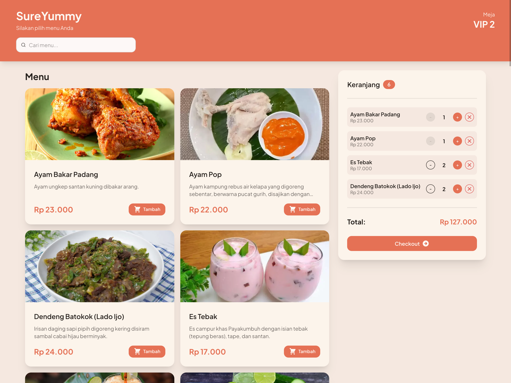
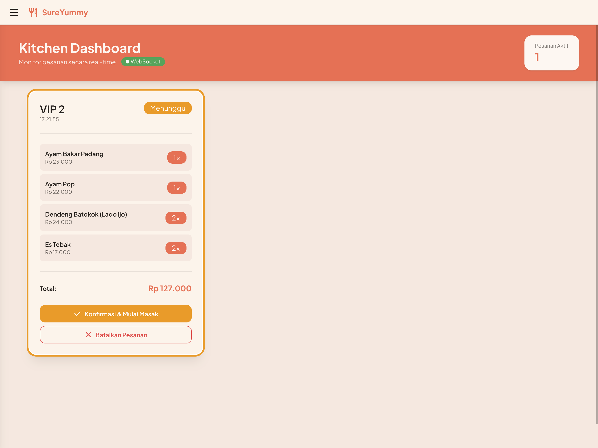
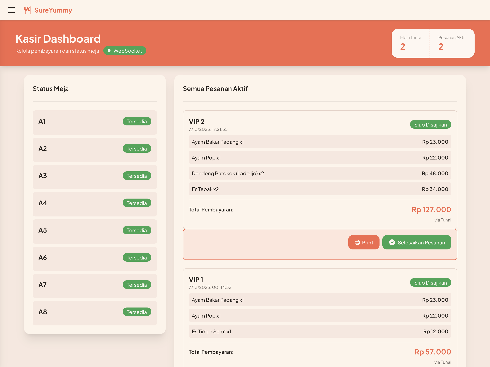
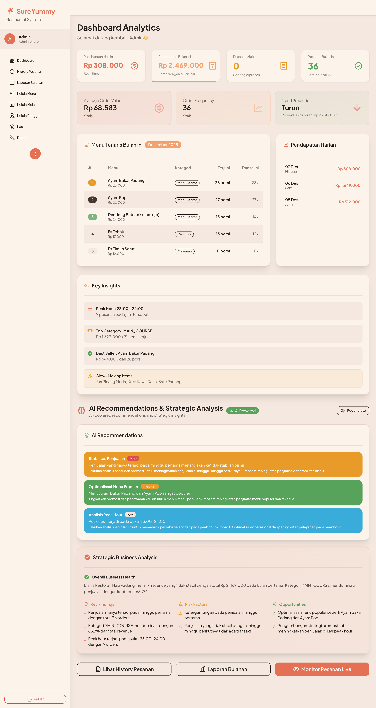

# 🎮 Demo - SureYummy POS

Demo environment untuk testing dan preview fitur SureYummy.

---

## 🌐 Demo URL

**Live Demo**: [https://sureyummy.vercel.app](https://sureyummy.vercel.app)

> **Note**: Beberapa fitur management tidak dapat digunakan saat mode demo, deploy untuk pengalaman penuh.

---

## 👥 Test Accounts

Gunakan credentials berikut untuk login:

### 👑 Admin Account
```
Email: admin@sureyummy.com
Password: admin123
```

**Access:**
- ✅ Full dashboard dengan AI analytics
- ✅ Menu management (CRUD)
- ✅ Table management
- ✅ Order history & reports
- ✅ User management (future)

**Try:**
1. Login sebagai admin
2. Go to `/dashboard` untuk lihat AI Business Intelligence
3. Generate AI insights (klik tombol)
4. Explore menu management di `/menu`
5. Manage tables di `/table`

---

### 💰 Cashier Account
```
Email: cashier@sureyummy.com
Password: cashier123
```

**Access:**
- ✅ Cashier dashboard
- ✅ Process payments
- ✅ Print receipts
- ✅ Table management
- ✅ Order history

**Try:**
1. Login sebagai cashier
2. Go to `/cashier`
3. Select table dengan active orders
4. Confirm payment
5. Click "Cetak Struk" untuk print receipt

---

### 👨‍🍳 Kitchen Account
```
Email: kitchen@sureyummy.com
Password: kitchen123
```

**Access:**
- ✅ Kitchen display system
- ✅ Update order status
- ✅ Real-time notifications

**Try:**
1. Login sebagai kitchen staff
2. Go to `/live` (auto-redirect)
3. Lihat incoming orders dengan highlight
4. Click "Konfirmasi & Mulai Masak" untuk PENDING orders
5. Click "Tandai Siap" untuk PREPARING orders
6. Order READY akan auto-removed dari display

---

## 🪑 Test Tables - QR Ordering

Gunakan link berikut untuk test ordering sebagai customer (tanpa login/sudah logout):


| Meja A | Meja B | Meja C | Meja D |
|--------|--------|--------|--------|
| [A1](https://sureyummy.vercel.app/order/a1) | [B1](https://sureyummy.vercel.app/order/b1) | [C1](https://sureyummy.vercel.app/order/c1) | [D1](https://sureyummy.vercel.app/order/d1) |
| [A2](https://sureyummy.vercel.app/order/a2) | [B2](https://sureyummy.vercel.app/order/b2) | [C2](https://sureyummy.vercel.app/order/c2) | [D2](https://sureyummy.vercel.app/order/d2) |
| [A3](https://sureyummy.vercel.app/order/a3) | [B3](https://sureyummy.vercel.app/order/b3) | [C3](https://sureyummy.vercel.app/order/c3) | [D3](https://sureyummy.vercel.app/order/d3) |
| [A4](https://sureyummy.vercel.app/order/a4) | [B4](https://sureyummy.vercel.app/order/b4) | [C4](https://sureyummy.vercel.app/order/c4) | [D4](https://sureyummy.vercel.app/order/d4) |
| [A5](https://sureyummy.vercel.app/order/a5) | [B5](https://sureyummy.vercel.app/order/b5) | [C5](https://sureyummy.vercel.app/order/c5) |
| [A6](https://sureyummy.vercel.app/order/a6) | [B6](https://sureyummy.vercel.app/order/b6) | [C6](https://sureyummy.vercel.app/order/c6) |
| [A7](https://sureyummy.vercel.app/order/a7) |
| [A8](https://sureyummy.vercel.app/order/a8) | 


## 📸 Screenshots

### Customer Ordering


### Kitchen Display


### Cashier Dashboard


### Admin Dashboard

---


## 🎯 Demo Scenarios

### Scenario 1: Complete Order Flow
**Waktu: ~5 menit**

1. **Customer Orders** (No login required)
   - Buka link meja (contoh: `/order/a1`)
   - Browse menu dan add items ke cart
   - Click "Pesan" untuk submit order
   - Note: Pesanan masuk sistem

2. **Kitchen Receives & Processes** (Login: kitchen@sureyummy.com)
   - Login di browser lain
   - Go to `/live`
   - Lihat order baru dengan highlight kuning
   - Click "Konfirmasi & Mulai Masak"
   - Wait beberapa detik (simulasi masak)
   - Click "Tandai Siap"
   - Order auto-removed dari display

3. **Cashier Completes Payment** (Login: cashier@sureyummy.com)
   - Login di browser lain
   - Go to `/cashier`
   - Find table A1 dengan READY order
   - Review order details
   - Click "Selesaikan Pesanan"
   - Print receipt (optional)

---

### Scenario 2: Menambah Pesanan di Session Aktif
**Waktu: ~5 menit**

1. **Customer 1 Orders** (`/order/b1`)
   - Add: Rendang, Nasi Putih, Es Teh
   - Submit order
   - Session aktif untuk Customer 1

2. **Customer 1 Menambah Pesanan** (Same browser/device)
   - Buka lagi `/order/b1`
   - Add: Gulai Ayam, Sambal
   - Submit order
   - Pesanan ditambahkan ke session yang sama

3. **Customer 2 Coba Order** (Different browser/device: `/order/b1`)
   - Muncul alert "Meja Sedang Digunakan"
   - Menu tidak bisa diakses
   - Harus tunggu Customer 1 selesai bayar

4. **Cashier Completes Payment** (Login: cashier)
   - Go to `/cashier`
   - Click table B1
   - See 1 session dengan 2 orders (Rendang + Gulai)
   - Pay untuk session tersebut
   - Session selesai, meja jadi available untuk customer lain

---

### Scenario 3: AI Upselling & Recommendations
**Waktu: ~3 menit**

1. **Customer Orders** (`/order/c1`)
   - Add: Rendang, Nasi Putih
   - Click "Pesan" untuk checkout

2. **AI Upselling Modal Appears**
   - AI analyze pesanan customer
   - Muncul modal dengan rekomendasi menu
   - Contoh: "Sambal Ijo", "Es Teh Manis", "Perkedel"
   - Setiap rekomendasi ada reason (alasan)

3. **Customer Action**
   - Option 1: Add recommended items ke cart
   - Option 2: Skip recommendations
   - Option 3: Proceed to checkout langsung
   - AI loading ~5-10 detik

---

### Scenario 4: AI Business Insights
**Waktu: ~3 menit**

1. **Admin Checks Analytics** (Login: admin@sureyummy.com)
   - Go to `/dashboard`
   - See daily revenue, orders, AOV
   - Review peak hours chart
   - Check top selling items

2. **Generate AI Insights**
   - Click "Generate AI Analysis" button
   - Wait ~5-10 seconds
   - Read AI-powered recommendations
   - See strategic insights untuk business

3. **Review Recommendations**
   - Marketing strategies
   - Menu optimization
   - Operational improvements
   - Revenue projections

---

### Scenario 5: Menu Management
**Waktu: ~5 menit**

1. **Admin Adds Menu** (Login: admin@sureyummy.com)
   - Go to `/menu`
   - Click "Tambah Menu"
   - Fill form:
     - Name: "Gulai Kambing"
     - Category: Main Course
     - Price: 45000
     - Description: "Gulai kambing empuk dengan bumbu rempah"
   - Upload image (optional)
   - Save

2. **Test Menu Availability**
   - Open table link (`/order/a1`)
   - Browse menu
   - See new "Gulai Kambing" item
   - Can be ordered immediately

3. **Edit/Delete Menu**
   - Back to `/menu` as admin
   - Edit price or description
   - Or delete menu item
   - Changes reflect instantly

---

## 📱 Test dari Mobile Device

### Option 1: Scan QR Code
1. Login as admin/cashier
2. Go to `/table`
3. Click "Print QR" pada salah satu meja
4. Scan QR dengan smartphone
5. Order langsung dari mobile

### Option 2: Share Link
1. Copy order link (contoh: `...vercel.app/order/a1`)
2. Share via WhatsApp/Telegram
3. Orang lain bisa langsung order
4. No login required

---

## 🔍 Features to Explore

### ✅ Implemented Features

- [x] QR Code digital ordering
- [x] Real-time kitchen display
- [x] WebSocket live updates
- [x] Payment method: Cash only (QRIS in roadmap)
- [x] Thermal receipt printing (80mm)
- [x] Session-based ordering (split bill)
- [x] AI business intelligence
- [x] AI upselling recommendations
- [x] Menu CRUD with image upload
- [x] Table management with QR generation
- [x] Order history with filters
- [x] Role-based access control
- [x] Responsive mobile UI
- [x] Dark mode support (DaisyUI)
- [x] Order cancellation (PENDING only)
- [x] Soft delete tables
- [x] Copy order link

### 🚧 Planned Features

- [ ] Customer loyalty program
- [ ] Inventory management
- [ ] Staff scheduling
- [ ] Multi-location support
- [ ] WhatsApp notifications
- [ ] Email receipts
- [ ] Advanced reporting (PDF export)
- [ ] Reservation system

---

## ⚠️ Demo Limitations

**Shared Environment:**
- Data dapat berubah karena multi-user access
- Orders dapat dibuat oleh user lain
- Menu dapat diubah/dihapus

**AI Credits:**
- AI insights limited untuk demo
- Mungkin ada rate limiting

**Performance:**
- Free tier database (Neon)
- WebSocket dapat delay di high traffic
- Image upload ada size limit

**Recommendations:**
- Test di non-peak hours untuk best experience
- Don't rely on demo data untuk production
- Setup own instance untuk serious testing

---

## 🚀 Next Steps

Setelah testing demo:

1. **Setup Local Instance**
   - Follow [SETUP.md](./SETUP.md) guide
   - Use your own database
   - Configure own AI API keys

2. **Customize for Business**
   - Change menu items
   - Adjust table layout
   - Customize receipt template
   - Configure payment methods

3. **Deploy to Production**
   - Use Vercel/Netlify
   - Setup production database
   - Configure domain
   - Enable HTTPS

4. **Get Support**
   - Read [README.md](./README.md)
   - Open GitHub issues
   - Contact developer

---

**Enjoy testing! 🎉**

**Questions?** Open issue di [GitHub](https://github.com/fdvky1/sureyummy/issues)
